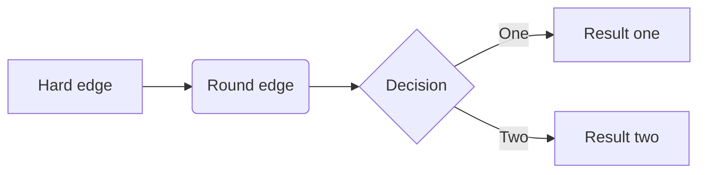

# Breast Cancer Predictor app

## Overview
A streamlit app designed to diagnose breast cancer using machine learning and public data set [Breast Cancer Wisconsin (Diagnostic) Data Set](https://www.kaggle.com/datasets/uciml/breast-cancer-wisconsin-data)


## Installation
To run the Cell Image Analyzer locally, you will need to have Python 3.6 or higher installed. Then, you can install the required packages by running:

```{python}
pip install -r requirements.txt
```

[Link to the live app](https://breastcancerprediction-cqi1j6yd36.streamlit.app/)

